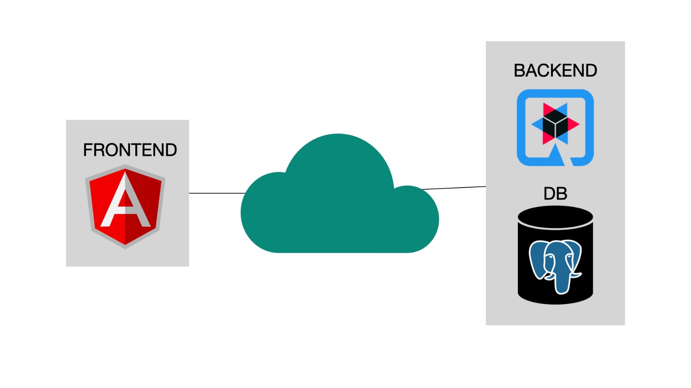
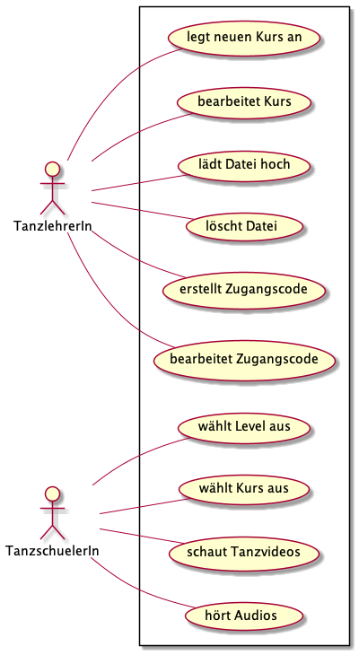
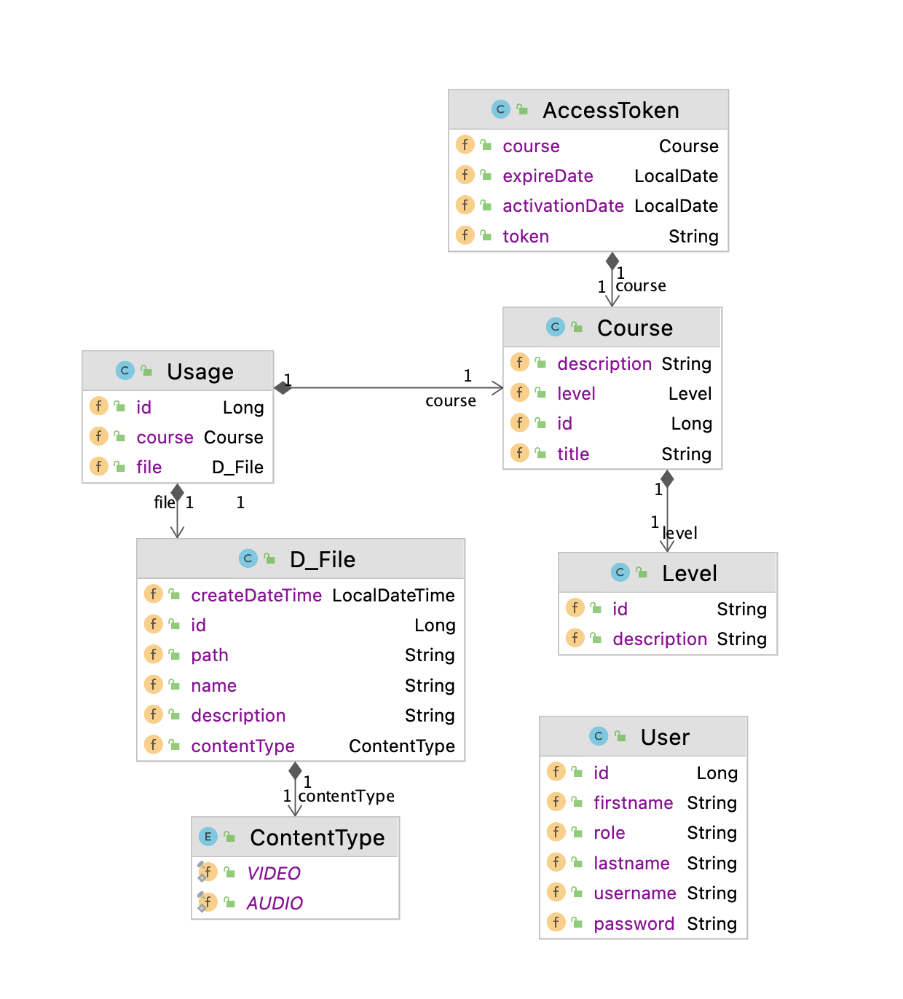

# Online-Dance-Practice

## Webanwendung benutzen
* Damit das Abspielen der Videos und Audios funktioniert, dürfen Sie sich nicht im HTL-Leonding Schulnetzwerk befinden.
* Link zur Anwendung: http://141.147.26.152/
* Account zur Anmeldung als Lehrer:
  - Benutzername: TeacherAccount
  - Passwort: passwordTeacher
* Account zur Anmeldung als Schüler:
  - Benutzername: StudentAccount
  - Passwort: passwordStudent
* Zugangscode für Grundkurs Cha Cha Cha:
  - FSFaZ
## Content von Victoria Lauda zum Hochladen
- https://cloud.voeslan.at/s/zS2nZNDjkYH9gsk

## Github-Repository
- https://github.com/htl-leonding-project/2021-da-online-dance-practice-2

## Projektorganisation
- Youtrack: https://vm81.htl-leonding.ac.at/agiles/99-260/100-1207

## Systemarchitektur

## Use-Case Diagramm

## Klassendiagramm

