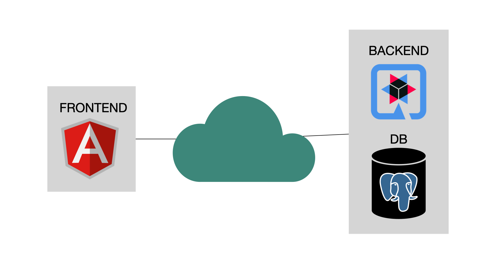
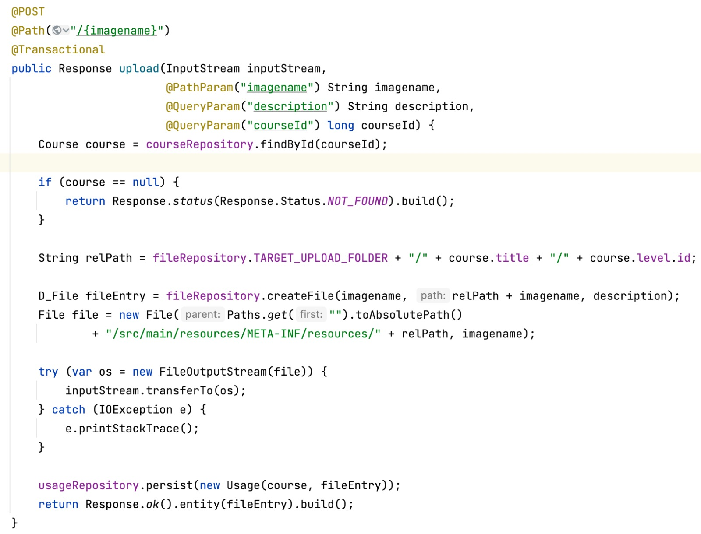
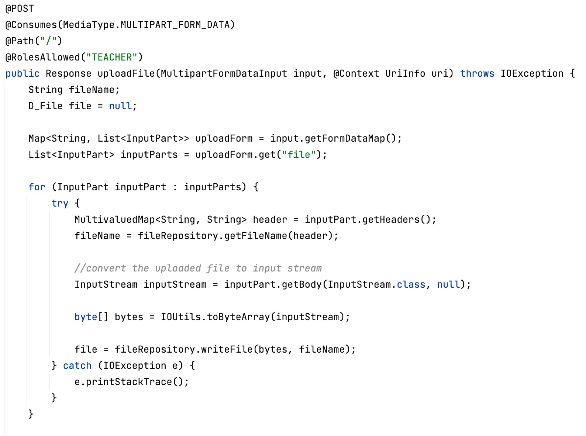
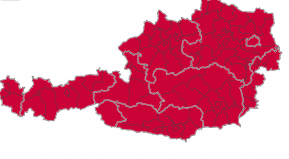

[.lightbg,background-video="videos/dance.mp4",background-video-loop="true",background-opacity="0.5"]
== ONLINE DANCE PRACTICE

[.lightbg,background-image="images/dancing.jpg",background-opacity="0.3"]

[.lightbg,background-image="images/dancing.jpg",background-opacity="0.3"]
=== Warum die ONLINE DANCE PRACTICE APP?
* Hilfreich für TanzschülerInnen während der Pandemie
*** Verbindung zwischen SchülerInnen und der Tanzschule bleibt aufrecht

[.lightbg,background-image="images/dancing.jpg",background-opacity="0.3"]
=== PERSÖNLICHER BEZUG

[.lightbg,background-image="images/dancing.jpg",background-opacity="0.3"]
== LIVE DEMO

//[.lightbg,background-image="images/dancing.jpg",background-opacity="0.3"]
//== GESCHÄFTSPROZESS
//* Die TanzschülerInnen können sich Videos und Audios zu den passenden Levels und Kursen anschauen
//
//[.lightbg,background-image="images/dancing.jpg",background-opacity="0.3"]
//== NEBENPROZESS
//* Videos und Audios können hochgeladen und verwaltet werden
//* Kurse können hinzugefügt und verwaltet werden
//* Accesstoken können hinzugefügt und verwaltet werden

[.lightbg,background-image="images/dancing.jpg",background-opacity="0.3"]
=== ANMELDUNG
* Anmeldung entweder mit einem Zugangscode oder Anmeldedaten
** Grund -> TanzschülerInnen müssen sich nicht so viele Gedanken über Username und Passwort machen

[.lightbg,background-image="images/dancing.jpg",background-opacity="0.3"]
=== SYSTEMARCHITEKTUR

[.lightbg,background-image="images/dancing.jpg",background-opacity="0.3"]
=== TECHNOLOGIEN

[.lightbg,background-image="images/dancing.jpg",background-opacity="0.3"]
=== File Upload

[.lightbg,background-image="images/dancing.jpg",background-opacity="0.3"]
=== Unsere nächsten Schritte
* automatisches Deployment fertigstellen

[.lightbg,background-video="videos/dance2.mp4",background-video-loop="true",background-opacity="0.4"]
== Danke für Ihre Aufmerksamkeit!

//[.col3-r.big]
//--
//
//--
